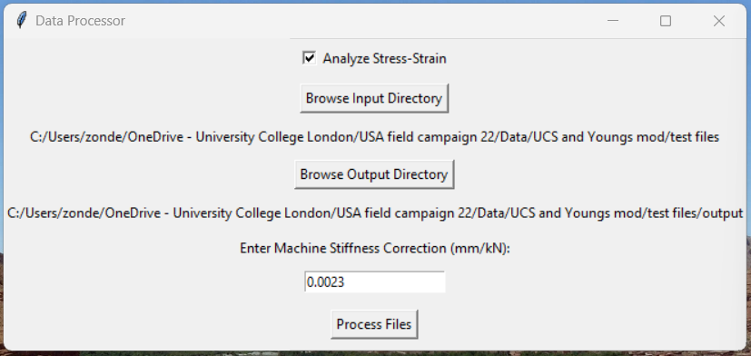
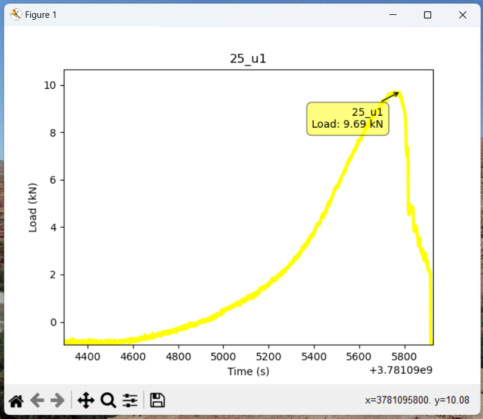
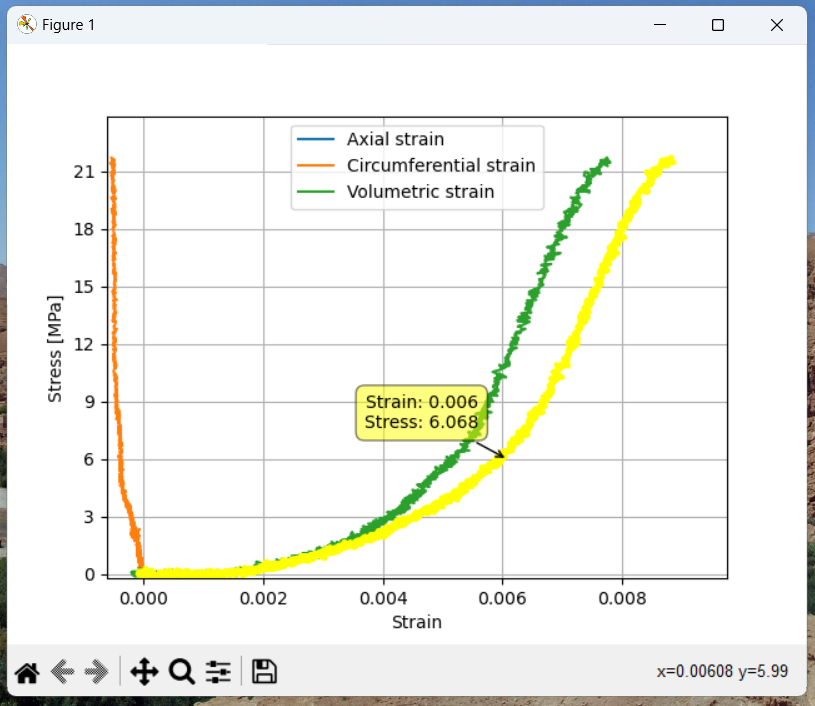
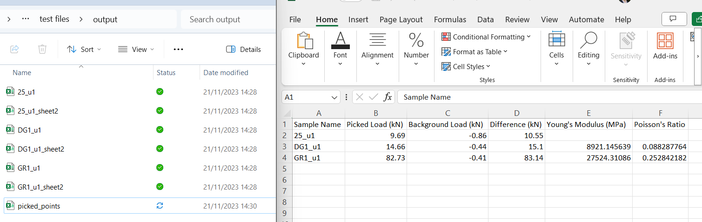

# Process Uniaxial TDMS

## Overview
"Process Uniaxial TDMS" is a standalone Windows application that facilitates the processing of TDMS files generated from uniaxial tests. It provides a user-friendly graphical interface, allowing users to select input and output directories, convert TDMS files to CSV format, pick key data points, and perform optional stress-strain analysis to derive Young's Modulus and Poisson's Ratio.

## System Requirements
- Operating System: Windows 7 or later (64-bit recommended).
- Python: No Python installation required, as the application is a standalone executable.
- Memory: At least 2 GB RAM (4 GB recommended).
- Storage: At least 100 MB free space for the application, plus additional space for data files.

## Installation
No installation is necessary. The application is distributed as a single executable file:

1. Download "Process Uniaxial TDMS.exe" from the [Releases](https://github.com/jessezondervan/Process-Uniaxial-TDMS/releases/) page.
2. Place the executable in your desired directory.
3. Run the application by double-clicking on the executable. (note: The app may take a few seconds to start up as your antimalware software may be scanning it. I haven't yet implemented a splash screen that shows you it is loading. Don't worry, it will start, patience is king 😉)

## Usage
Follow these steps to process your TDMS files:

1. **Select Input Directory**: Click "Browse Input Directory" to choose the folder containing your TDMS files.
2. **Select Output Directory**: Click "Browse Output Directory" to specify where the processed files and results will be stored.
3. **Process Files**: Click "Process Files" to start the conversion and analysis. 

## Interactive Features
"Process Uniaxial TDMS" is designed with user interaction in mind, making data processing both intuitive and efficient. Key interactive features include:

### Directory Selection
- **Input Directory**: Use the GUI to browse and select the directory that contains your TDMS files. This is where the application will read the files for processing.
- **Output Directory**: Choose where the processed files and results should be saved. The application will create CSV files and save them in this directory.

### Picking Points on Graphs
- **Load vs Time Graph**: After processing the files, the application displays a Load vs Time graph for each sample. You can interactively select a point on this graph, and the application will calculate and display key information like picked load, background load, and the difference. After picking the point close the graph window to move on: you will get all the results in the CSV output file at the end.
- **Stress-Strain Graph (Optional)**: If performing stress-strain analysis, the application plots stress-strain curves. You can interactively pick two points on the axial strain curve to select the linear range of stress-strain behaviour. This range is then used to calculate Young's modulus and Poisson's ratio, which are added to the output CSV. After picking the two points on the axial strain curve close the graph window to move on: you will get all the results in the CSV output file at the end.

### Stress-Strain Analysis
- This optional feature is triggered if selected and requires additional sample data (like thickness and diameter) to be provided in a separate CSV file. The application uses this data along with the TDMS file data to plot stress-strain curves and enable point selection for calculating Young's modulus and Poisson's ratio.

## Demo and Screenshots

### Application Walkthrough
Watch a quick [demo video](https://www.loom.com/share/826cae88ab2f4daaa1cf9bd09273efe6?sid=ce39c783-9781-48fa-9830-d0c77446daec) of the application in action, demonstrating key features and workflows.

### Screenshots

  
  
<i>Main Interface of the Application</i>

  
  
<i>Interactive Graph for Picking Yield Strength</i>

  
  
<i>Interactive Graph for Picking Linear Stress-Strain Range</i>

  
  
<i>Viewing the Calculated Results</i>

## Example Data
Stress-strain analysis for the calculation of Young's Modulus and Poisson's ratio is optional. If you do select this option, read this section.
An example CSV file (`sample_info.csv`) is provided in the [examples](https://github.com/jessezondervan/Process-Uniaxial-TDMS/tree/main/examples) directory. This file includes sample names, average thickness, and diameter values necessary for stress-strain analysis. The file names needs to be `sample_info.csv` and located in the input directory with the TDMS files, and sample names in this CSV should correspond to the names of the TDMS files, including any captioning.

### Format of the Example CSV
- **Sample Name**: The names of the samples, matching the TDMS file names (including captions).
- **Average Thickness**: The average thickness of the samples in millimeters.
- **Average Diameter**: The average diameter of the samples in millimeters.

Ensure that your data files adhere to this format for the stress-strain analysis to work correctly.

### Configuration
Enter the machine stiffness correction factor (default 0.0023 mm/kN) in the provided input field if necessary.

## Output
The application outputs a CSV file with results from the analysis of interactive plots, including from stress-strain analysis if selected.

## Troubleshooting
If the application does not start, ensure that your system meets the requirements and that you have the appropriate permissions to execute the program.

For file processing issues, confirm that the input directory contains valid TDMS files and that the output directory is not write-protected.

## Contributing
Contributions to the project are welcome! Please submit issues or pull requests through the GitHub repository.

## License
This project is licensed under the [MIT License](https://github.com/jessezondervan/Process-Uniaxial-TDMS/blob/main/LICENSE) - see the LICENSE file for details.

